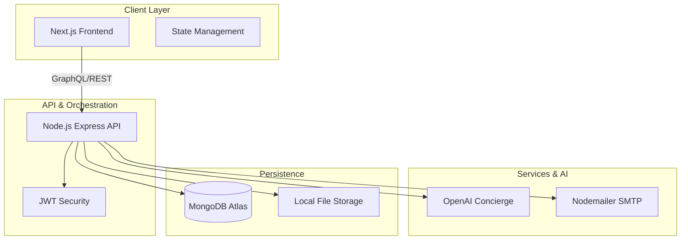
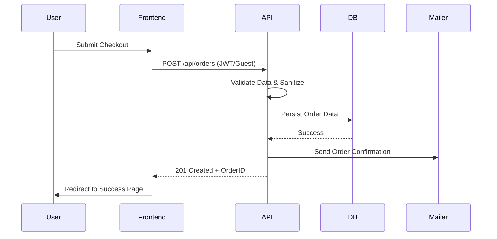

# 🏗️ Technical Architecture: Skardu Spring

This document provides a comprehensive deep-dive into the design, technical decisions, and structural integrity of the Skardu Spring ecosystem. It is intended for developers, stakeholders, and contributors.

---

## 📐 System Overview

Skardu Spring is built as a high-performance, scalable monorepo. It leverages a modern full-stack architecture to deliver a premium e-commerce experience with AI-integrated customer support.

---

## 📁 Directory Structure & Logic

The project follows a modular, domain-driven structure to ensure separation of concerns and maintainability.

### 1. `/frontend` (Next.js 15+)
- **App Router**: Leverages server components for SEO and client components for interactivity.
- **Design System**: A centralized `globals.css` with HSL-tailored tokens and glassmorphism utilities.
- **Component Architecture**: Atomic design principles (Atoms -> Molecules -> Organisms).

### 2. `/backend` (Express.js)
- **Modular Routes**: Logic is split by domain (e.g., `/orders`, `/admin`, `/assistant`).
- **Middleware-First**: Centralized error handling and JWT verification.
- **Service Layer**: Business logic is abstracted into services (Email, AI, Database) to keep routes clean.

---

## 🔄 Data & Request Flow

Understanding how data moves through the system is critical for debugging and scaling.

### Order Processing Flow

---

## 🔐 Security Framework

Security is baked into the architecture, not added as an afterthought.

- **Authentication**: JWT-based stateless authentication for all administrative operations.
- **Sanitization**: Request bodies are sanitized to prevent XSS and NoSQL injection.
- **Environment Management**: Secrets are managed via `.env` files, with strict `.gitignore` rules to prevent credential leakage.
- **CORS Strategy**: Explicitly defined origin policies to prevent unauthorized cross-site requests.

---

## 🎨 Design Philosophy: "Digital Purity"

The UI/UX is built on the concept of **"Glacial Aesthetics"**:
- **Transparency**: Extensive use of glassmorphism to mimic ice and water.
- **Fluidity**: Framer Motion orchestrates all transitions to feel organic and liquid.
- **Typography**: A balanced mix of *Playfair Display* (Elegance) and *Inter* (Clarity).

---

## 🛠️ Tech Stack Specification

| Layer | Technology | Rationale |
| :--- | :--- | :--- |
| **Frontend** | Next.js 15 | SSR for SEO, dynamic routing, and performance. |
| **Styling** | Vanilla CSS + Modules | Maximum flexibility and design precision. |
| **Animations** | Framer Motion | Industry standard for production-grade motion. |
| **Backend** | Node.js / Express | Fast, non-blocking I/O for concurrent requests. |
| **Database** | MongoDB | Flexible schema for evolving product data. |
| **AI Integration** | OpenAI SDK | GPT-4o for the AI Concierge experience. |

---

  <i>Documentation version 1.1.0 — Last Updated: April 2026</i>

