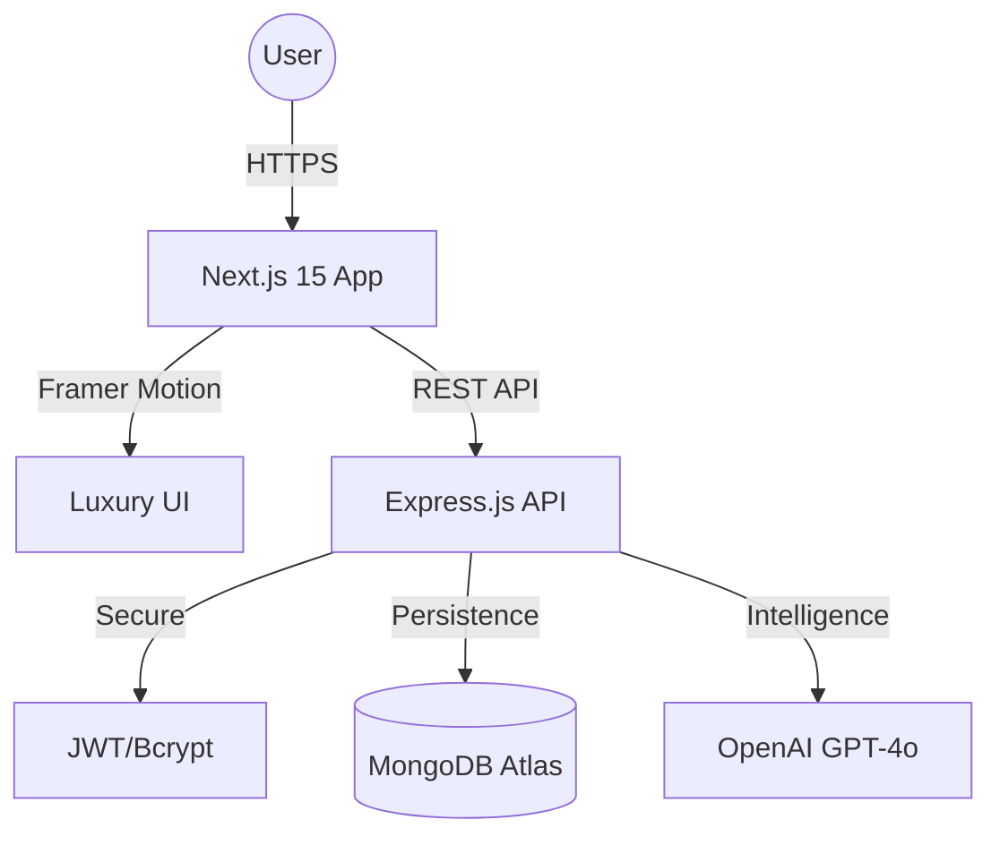

# 🌊 Skardu Spring Ecosystem
> **Absolute Purity. Born from the Heart of the Karakoram.**

[](https://github.com/tatheer583/Skardu-Spring-)
[](https://github.com/tatheer583/Skardu-Spring-/actions)
[](https://opensource.org/licenses/MIT)
[](https://nextjs.org/)
[](https://nodejs.org/)

[](https://vercel.com/new/clone?repository-url=https%3A%2F%2Fgithub.com%2Ftatheer583%2FSkardu-Spring-&root-directory=frontend&env=OPENAI_API_KEY,EMAIL_USER,EMAIL_PASS,ADMIN_EMAIL&project-name=skardu-spring&repository-name=skardu-spring-frontend)

**Skardu Spring** is a premium, full-stack e-commerce ecosystem delivering the crystalline purity of the Karakoram. Built with Next.js 15, Express, and OpenAI, featuring a high-performance 'Digital Purity' design philosophy.

---

## 🎨 Digital Purity: The Design Philosophy

Skardu Spring isn't just a website; it's a digital experience. 
- **Glacial Motion**: Powered by `framer-motion` for fluid, organic transitions.
- **Glassmorphism**: A UI that mimics the transparency and depth of ice.
- **Micro-interactions**: Subtle tactile feedback on every click and hover.

---

## 🏗️ Architecture at a Glance

The ecosystem is architected as a high-performance monorepo:

- **`/frontend`**: Next.js 15+ App Router, optimized for sub-second LCP and premium interactivity.
- **`/backend`**: Modular Express.js API designed for high concurrency and secure data persistence.
- **`/logic`**: Advanced service layers for AI Concierge (OpenAI) and automated logistics.



---

## 🚀 Quick Start

### 1. Zero-Config Installation
```bash
npm install && npm run install:all
```

### 2. Environment Configuration
Create a `.env` in both `/frontend` and `/backend` based on provided `.env.example` templates.

### 3. Launch Development Mode
```powershell
./start-all.ps1
```

---

## 🛠️ The Tech Stack

### Frontend Excellence
- **Core**: Next.js 15, React 19
- **Motion**: Framer Motion (Liquid animations)
- **Styling**: Vanilla CSS Modules (Design precision)
- **Slider**: Swiper.js (Premium carousels)

### Backend Robustness
- **Runtime**: Node.js 20+
- **Framework**: Express.js (Modular Routing)
- **Database**: MongoDB / Mongoose (NoSQL)
- **Auth**: JSON Web Tokens (JWT)
- **Services**: OpenAI SDK, Nodemailer

---

## 📄 License

Distributed under the MIT License. See `LICENSE` for more information.

---

<p align="center">
  
</p>
