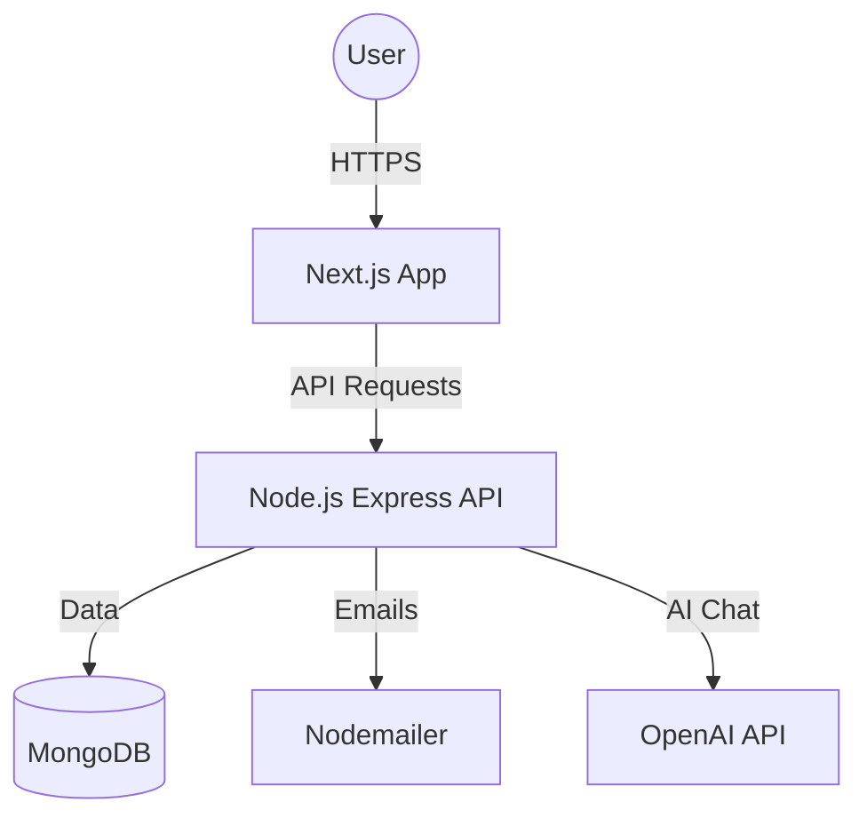

# 🌊 Skardu Spring Ecosystem

[](https://github.com/tatheer583/skardu-spring)
[](https://opensource.org/licenses/MIT)
[](https://nextjs.org/)
[](https://nodejs.org/)

**Skardu Spring** is a premium, full-stack e-commerce platform dedicated to delivering the absolute purity of Karakoram glacial water. Built with modern technologies and a luxury-first design philosophy, it offers a seamless experience from source to doorstep.

---

## 🏗️ Architecture Overview

The project is organized as a monorepo containing:

- **`/frontend`**: A high-performance Next.js application featuring glassmorphism design, smooth animations (Framer Motion), and responsive layouts.
- **`/backend`**: A robust Node.js/Express REST API with modular architecture, JWT authentication, and MongoDB integration.
- **`/legacy`**: (Internal) Legacy static prototypes used for rapid iteration.



---

## 🚀 Getting Started

### 1. Prerequisites
- **Node.js** (v20 or higher)
- **MongoDB** (Running locally or MongoDB Atlas)
- **OpenAI API Key** (For the chatbot feature)

### 2. Installation
Clone the repository and install dependencies in one command:
```bash
npm run install:all
```

### 3. Environment Setup
Copy the `.env.example` files in both `/frontend` and `/backend` to `.env` and fill in your credentials.

### 4. Launch Ecosystem
Use our professional startup script to boot both services:
```powershell
./start-all.ps1
```

---

## ✨ Key Features

- **Luxury UI/UX**: Custom-tailored design system reflecting purity and glacial aesthetics.
- **AI Concierge**: Integrated GPT-powered assistant for expert product knowledge.
- **Secure Checkout**: Streamlined ordering process with automated email confirmations.
- **Admin Dashboard**: Real-time order management and customer inquiry tracking.
- **Professional Backend**: Modular routing, centralized error handling, and secure authentication.

---

## 🛠️ Tech Stack

- **Frontend**: Next.js, React, Framer Motion, Swiper.js, CSS Modules.
- **Backend**: Node.js, Express, Mongoose, JSON Web Tokens (JWT).
- **Services**: OpenAI API, Nodemailer (SMTP), MongoDB.

---

## 📄 License

This project is licensed under the MIT License - see the [LICENSE](LICENSE) file for details.

---

<p align="center">
  Developed with ❤️ for Skardu Spring
</p>
